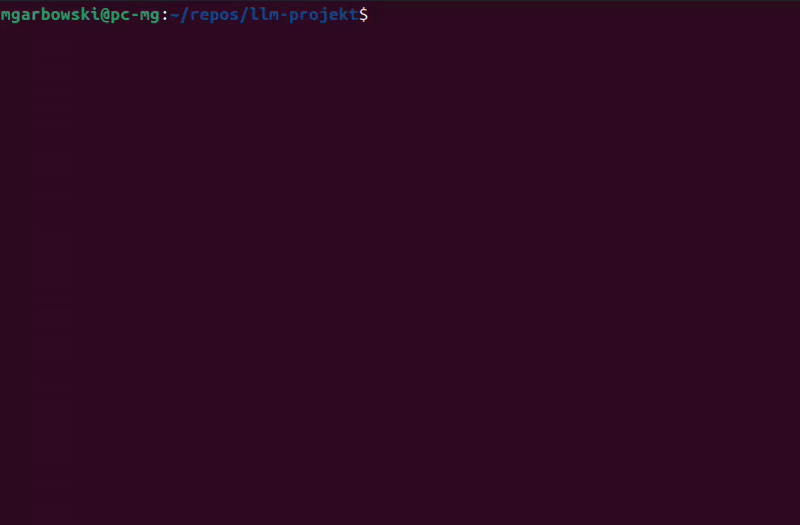

# LLM - projekt

Mikołaj Garbowski


## Opis

Celem projektu jest implementacja systemu Retrieval-Augmented Generation (RAG) wykorzystującego
duży model językowy (LLM) do generowania odpowiedzi na pytania użytkownika na podstawie bazy dokumentów oraz
ewaluacja skuteczności opracowanego rozwiązania na samodzielnie przygotowanym zbiorze testowym.

Za zbiór dokumentów posłużą moje notatki z wykładów na Politechnice Warszawskiej w formacie markdown,
sporządzone w toku studiów inżynierskich.

## Koncepcja rozwiązania

* Dokumenty zostaną podzielone na fragmenty (chunks)
    * długość tak dobrana, żeby zmieścić się w oknie kontekstowym modeli
* Fragmenty z zanurzeniami i metadanymi będą zapisane w bazie danych
* Aplikacja backend
    * FastAPI + SentenceTransformers + transformers
    * wyszukiwanie (retrieval)
        * leksykalne: wyszukiwanie pełnotekstowe w PostgreSQL
        * semantyczne: bi-enkoder do wyznaczania wektorów zanurzeń
    * reranking
        * wyniki wyszukiwania z obu wariantów są łączone
        * cross-enkoder ocenia istotność każdego z fragmentów względem pytania
        * wynikiem jest lista fragmentów posortowana wg. istotności
    * generacja odpowiedzi
        * na wejście LLM trafia pytanie wraz z kontekstem złożonym z najbardziej istotnych fragmentów
* Aplikacja frontend
    * prosta aplikacja w React z okienkiem czatu w stylu popularnych serwisów
* Baza danych
    * PostgreSQL
    * rozszerzenie pgvector do przechowywania i indeksowania wektorów zanurzeń
    * wbudowana funkcjonalność wyszukiwania pełnotekstowego
    * rozszerzony o konfigurację dla języka polskiego (zobacz sekcję Źródła)

## Modele i algorytmy

Projekt ma charakter edukacyjny i będzie uruchamiany własnej maszynie wyposażonej w GPU NVIDIA GTX 1060 6GB.
Wybierając modele, kieruję się tymi ograniczeniami sprzętowymi.

* Generator - `speakleash/Bielik-1.5B-v3.0-Instruct`
* Retriever
    * PostgreSQL full-text search (wariant leksykalny)
    * bi-enkoder `sdadas/mmlw-retrieval-roberta-large`
* Reranker
    * cross-enkoder `sdadas/polish-reranker-roberta-v3`

## Zbiór testowy

Na potrzeby ewaluacji opracowałem zbiór testowy składający się z 38 pytań
wraz z listą istotnych fragmentów dokumentów oraz wzorcowymi odpowiedziami.

Plik [`test.jsonl`](./data/eval/test.jsonl) w formacie JSONL (każda linijka to osobny JSON),
pojedynczy wiersz jest w formacie:

```json
{
  "query": "Co to jest partycjonowanie zakresowe i kiedy warto je stosować?",
  "relevantDocs": [
    "25a8cb17-d17f-4522-8243-3da0f8f6491f",
    "decb07c0-fb6e-4fb5-80ac-520eda2521e2"
  ],
  "referenceAnswers": [
    "Partycjonowanie zakresowe dzieli dane na partycje według zakresów wartości klucza..."
  ]
}
```

Został przygotowany z użyciem LLM GPT-5 mini i poddany ręcznej weryfikacji i korekcie.

## Ewaluacja

Oddzielnie przeprowadziłem ewaluację komponentu retrieval oraz jakości generowanych odpowiedzi (pełnego potoku RAG).

### Retrieval

Metryki są wyliczane na podstawie `relevantDocs` w zbiorze testowym i wyników zwróconych przez komponent retrieval.
Porównywane są trzy warianty:

* leksykalny (PostgreSQL full-text search)
* semantyczny (bi-enkoder)
* leksykalne + semantyczny + reranker

Porównywane są miary jakości Recall@k (niezależne od kolejności dokumentów w wyniku)
oraz MRR@k (uwzględniające kolejność, im wyżej w rankingu jest pierwszy istotny dokument, tym lepiej).

|           | Fulltext Retriever ('simple') | Fulltext Retriever ('polish') | Semantic Retriever | Reranking Retriever |
|:----------|------------------------------:|------------------------------:|-------------------:|--------------------:|
| Recall@1  |                          0.19 |                          0.13 |               0.33 |                0.50 |
| Recall@3  |                          0.30 |                          0.21 |               0.59 |                0.67 |
| Recall@5  |                          0.33 |                          0.32 |               0.66 |                0.71 |
| Recall@10 |                          0.35 |                          0.39 |               0.71 |                0.73 |
| MRR@1     |                          0.29 |                          0.24 |               0.55 |                0.79 |
| MRR@3     |                          0.35 |                          0.28 |               0.69 |                0.86 |
| MRR@5     |                          0.36 |                          0.32 |               0.70 |                0.86 |
| MRR@10    |                          0.37 |                          0.33 |               0.70 |                0.86 |

Zaskakujące jest, że wariant wyszukiwania leksykalnego z użyciem konfiguracji `polish`
(wsparcie dla stemmingu, usuwania *stop words* itp.) wypada gorzej niż generyczny wariant `simple`.
Cały zbiór dokumentów jest w języku polskim, więc spodziewałem się znacznie lepszych wyników.

### Generacja odpowiedzi

Metryki są wyliczane na podstawie `referenceAnswers` w zbiorze testowym i odpowiedzi wygenerowanych przez pełny potok
RAG
(z użyciem wariantu wyszukiwania leksykalnego + semantycznego + reranking).

|                        | Prompt 1 | Prompt 2 |
|:-----------------------|---------:|---------:|
| BERT Score - Precision |     0.65 |     0.65 |
| BERT Score - Recall    |     0.73 |     0.73 |
| BERT Score - F1        |     0.68 |     0.69 |
| ROUGE-L - Precision    |     0.13 |     0.12 |
| ROUGE-L - Recall       |     0.36 |     0.34 |
| ROUGE-L - F1           |     0.18 |     0.17 |
| BLEU Score             |     3.74 |     1.71 |

Prompt 1:

```
Jesteś pomocnym asystentem, odpowiadaj krótko po polsku na podstawie kontekstu. Cytuj źródła w nawiasach kwadratowych [...].
```

Prompt 2 (z laboratorium):

```
Odpowiedz na pytanie użytkownika wykorzystując tylko informacje znajdujące się w dokumentach, a nie wcześniejszą wiedzę 
Udziel wysokiej jakości, poprawnej gramatycznie odpowiedzi w języku polskim. 
Odpowiedź powinna zawierać cytowania do dokumentów, z których pochodzą informacje. 
Zacytuj dokument za pomocą symbolu [nr_dokumentu] powołując się na fragment np. [0] dla fragmentu z dokumentu 0.
Jeżeli w dokumentach nie ma informacji potrzebnych do odpowiedzi na pytanie, 
zamiast odpowiedzi zwróć tekst: Nie udało mi się odnaleźć odpowiedzi na pytanie
```

### Przykładowe odpowiedzi

Poniżej kilka przykładów ze zbioru testowego.
Pytanie, odpowiedź wygenerowana przez system RAG oraz wzorcowa odpowiedź.

#### Co to jest semafor?

##### Odpowiedź systemu

```
Semafor to narzędzie systemowe w systemach operacyjnych, które jest używane do zarządzania dostępem do wspólnych zasobów
przez wiele procesów. Semafory pozwalają na synchronizację procesów, umożliwiając im współdzielenie zasobów bez
konfliktów.

Semafory są inicjowane przez system operacyjny z określoną wartością, która określa maksymalną liczbę procesów, które
mogą jednocześnie korzystać z zasobu. Kiedy proces chce uzyskać dostęp do zasobu, inicjuje działanie semafora (operacja
`P`). Proces musi wówczas czekać (blokuje się) na zwolnienie zasobu przez innego proces (operacja `V`). Po zwolnieniu
zasobu, proces, który go zablokował, może kontynuować działanie.

Semafory mogą być nazwane i udostępniane innym procesom przez ich nazwy. Można je tworzyć, niszczyć, blokować, uwalniać,
otwierać, zamykać i usuwać. Dostępne są różne operacje na semaforach, takie jak `sem_init`, `sem_destroy`, `sem_wait`,
`sem_post`, `sem_open`, `sem_close`, `sem_unlink`.

Semafory mogą być również używane
```

##### Wzorcowa odpowiedź

```
Semafor to zmienna nieujemna sterująca synchronizacją, z operacjami P (proberen) i V (verhogen). P zmniejsza semafor i
może zablokować proces jeśli wartość ≤0, V zwiększa semafor i potencjalnie budzi oczekujące procesy.
```

#### Co to jest atak wstrzyknięcia (injection)?

##### Odpowiedź systemu

```
Atak wstrzyknięcia, znany również jako **SQL Injection**, **XSS** (XML/XHTML Scripting), **XPATH Injection**, **JSON
Injection**, **HTTP Response Splitting**, **ORM Injection**, **Cmd Injection**, **LDAP Injection**, **Blind SQL
Injection**, **Timing Attack** i **Remote Code Execution**, polega na wstrzyknięciu złośliwego kodu do aplikacji webowej
lub bazy danych, aby uzyskać nieuprawniony dostęp do zasobów lub wykonać ataki na system.
```

##### Wzorcowa odpowiedź

```
Wstrzyknięcie polega na tym, że dane wejściowe wyłamują się z kontekstu i są interpretowane jako kod wykonywany przez
aplikację (np. SQL injection, command injection). Powoduje nieautoryzowane wykonanie poleceń i wyciek danych.
```

#### Jak optymalizator decyduje między dostępem sekwencyjnym a korzystaniem z indeksu?

##### Odpowiedź systemu

```
Optymalizator decyduje między dostępem sekwencyjnym a korzystaniem z indeksu na podstawie kilku czynników, takich jak:

- **Szerokość bloku**: Im szerszy blok, tym mniej często potrzebny jest dostęp sekwencyjny.
- **Liczba wierszy**: W małych tabelach dostęp sekwencyjny jest szybszy, ale w dużych tabelach lepiej korzystać z
  indeksów.
- **Złożoność zapytania**: Dla zapytań zwracających wiele wierszy (np. 10% wszystkich wierszy) lepszym wyborem jest
  dostęp sekwencyjny.
- **Warunki zapytania**: Jeśli zapytanie zawiera złożone warunki, lepiej wybrać bardziej selektywny indeks, aby szybko
  przefiltrować wyniki.
- **Rodzaj indeksu**: Indeksy złożone (nazisko, imie) są bardziej selektywne i mogą natychmiast dostarczyć odpowiedzi.
  Indeksy mieszające (imie, nazwisko) są używane dla zapytań zwracających mało wierszy z dużych tabel. Indeksy bitmapowe
  są optymalne dla zapytań z wieloma warunkami i dużymi tabelami.
- **Konfiguracja systemu**: Optymalizator może być skonfigurowany do preferowania określonego typu dostępu.
```

##### Wzorcowa odpowiedź

```
Wybór zależy od selektywności warunku i statystyk: mała liczba wierszy - użycie indeksu; duża liczba wierszy - przegląd
sekwencyjny. Optymalizator korzysta ze statystyk tabel, kolumn i indeksów by oszacować koszty IO i CPU; dla złożonych
przypadków może łączyć wyniki kilku indeksów."
```

#### Do czego służą Docker Volumes?

##### Odpowiedź systemu

```
Docker Volumes służą do przechowywania danych dla kontenerów. Dzięki nim kontenery mogą mieć niezależne od siebie kopie
plików, nawet jeśli są uruchamiane w ramach tego samego klastra. Volumes mogą być udostępniane do odczytu lub zapisu i
są zarządzane przez Docker.
```

##### Wzorcowa odpowiedź

```
Docker Volumes służą do przechowywania danych trwałych poza cyklem życia kontenera. Pozwalają zachować dane po
wyłączeniu kontenera.
```

#### Co to są Stack Canaries i jak działają?

##### Odpowiedź systemu

```
Stack Canaries to techniki bezpieczeństwa stosowane w aplikacjach C/C++, mające na celu wykrycie przerwania wykonania
przez złośliwy kod przed jego wykonaniem. Nazwa pochodzi od kanarków używanych w kopalniach do wczesnego wykrywania
gazu, co w tym przypadku służy do wczesnego wykrywania przerwania wykonania programu.


### Jak działają stack canaries?

1. **Polegają na umieszczeniu losowo generowanej zmiennej na stosie przed adresem powrotu (adresem, do którego program
   wraca po zakończeniu wykonywania).**
2. **W przypadku przerwania wykonania przez złośliwy kod, zmienna ta zostanie zmieniona (np. przez wykonanie kodu
   wstrzymującego wykonanie), co uniemożliwi programowi powrót do oryginalnego adresu.**
3. **Zamiast tego, zmienna zostaje przekazana do narzędzia antymalware lub innej ochrony, które może ją zweryfikować i
   podjąć odpowiednie działania, takie jak zatrzymanie procesu lub wysłanie alarmu.**

### Dlaczego stack canaries są ważne?

Stack canaries są szczególnie przydatne w przypadku ataków takich jak **return-oriented programming (ROP)**, które
polegają na wykorzystaniu luki w bezpieczeństwie systemu
```

##### Wzorcowa odpowiedź

```
Stack Canaries to losowa wartość umieszczana na stosie przed adresem powrotu. Przed wykonaniem instrukcji `ret` sprawdza
się, czy kanarek nie został zmieniony - jeśli tak, wykrywa się przepełnienie stosu i przerywa wykonywanie.
```

## Instrukcja uruchomienia

Wymagana jest instalacja:

* Docker
* Docker Compose
* uv
* just
* Node.js i npm

Wszystkie polecenia są uruchamiane za pomocą `just`. Lista dostępnych poleceń można wyświetlić poleceniem `just -l`.

### Instalacja zależności

```bash
just install
```

### Tekstowy interfejs użytkownika



```bash
just answer "Twoje pytanie"
```

### Przygotowanie bazy danych

Surowy zbiór danych (notatki w formacie markdown) znajduje się w repozytorium (`data/raw`).

```bash
just chunk      # Podział dokumentów na fragmenty
just index      # Wyznaczenie zanurzeń dla wszystkich fragmentów
just create_db  # Uruchomienie bazy danych w kontenerze Docker
just seed       # Załadowanie fragmentów z wyliczonymi zanurzeniami do bazy danych
```

### Uruchomienie aplikacji

Wymaga uruchomionej bazy danych

```bash
just devb       # backend
just devf       # frontend
```

### Ewaluacja

```bash
just eval-retriever  # Ewaluacja komponentu wyszukiwania
just eval-pipeline   # Ewaluacja jakości generowanych odpowiedzi
```

## Struktura projektu

```
.
├── data         # dane surowe i przetworzone
├── database     # konfiguracja bazy danych
├── frontend     # aplikacja frontend
├── notebooks    # notatniki Jupyter
└── notes_rag    # system RAG
  ├── api        # aplikacja (REST API)
  ├── core       # logika systemu RAG
  ├── eval       # narzędzia do ewaluacji
  └── scripts    # skrypty pomocnicze
```

## Źródła

* Wykłady z przedmiotu Podstawy Wielkich Modeli Językowych na wydziale EiTI PW
* https://medium.com/@jesvinkjustin/from-zero-to-rag-the-art-of-document-chunking-and-embedding-for-rag-d9764695cc46
* https://medium.com/@nitinprodduturi/using-postgresql-as-a-vector-database-for-rag-retrieval-augmented-generation-c62cfebd9560
* https://www.evidentlyai.com/ranking-metrics/precision-recall-at-k
* https://www.evidentlyai.com/ranking-metrics/mean-reciprocal-rank-mrr
* [Konfiguracja PostgreSQL dla języka polskiego](https://github.com/judehunter/polish-tsearch)
