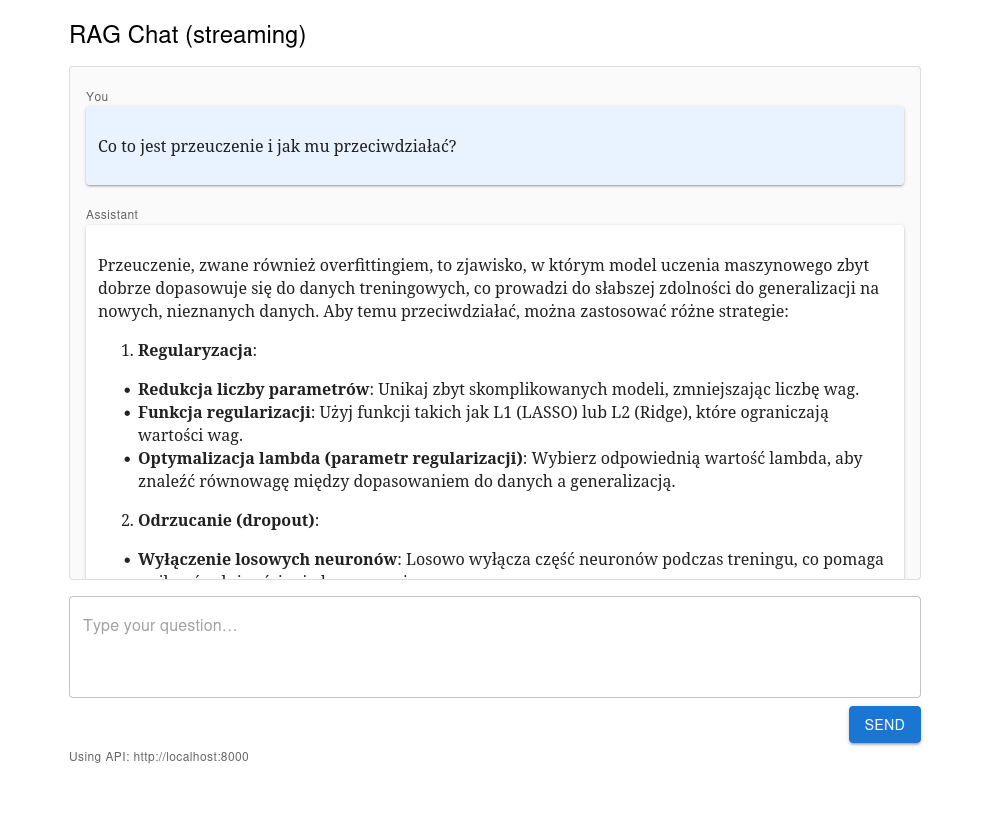

# LLM - projekt

Mikołaj Garbowski



## Opis

Celem projektu jest implementacja systemu Retrieval-Augmented Generation (RAG) wykorzystującego
duży model językowy (LLM) do generowania odpowiedzi na pytania użytkownika na podstawie bazy dokumentów oraz
ewaluacja skuteczności opracowanego rozwiązania na samodzielnie przygotowanym zbiorze testowym.

Za zbiór dokumentów posłużą moje notatki z wykładów na Politechnice Warszawskiej w formacie markdown,
sporządzone w toku studiów inżynierskich.

## Modele i algorytmy

System ma charakter edukacyjny i będzie uruchamiany na moim PC wyposażonym w GPU NVIDIA GTX 1060 6GB.
Wybierając modele, biorę pod uwagę te ograniczenia sprzętowe.

Duży model językowy (generator) będzie uruchomiony na GPU, natomiast pozostałe modele (retriever, reranker) będą
uruchomione na CPU.

* Generator - `speakleash/Bielik-1.5B-v3.0-Instruct`
* Retriever
    * PostgreSQL full-text search (wariant leksykalny)
    * bi-enkoder `sdadas/mmlw-retrieval-roberta-large` (przetestowany na laboratorium)
* Reranker
    * przetestowany na laboratorium
    * cross-enkoder `sdadas/polish-reranker-roberta-v3`

Do weryfikacji pozostaje wydajność modeli uruchomionych na CPU

## Koncepcja implementacji

* Dokumenty zostaną podzielone na fargmenty (chunki)
    * chunk ma się mieścić w kontekście modeli (przede wszystkim retrievera i rerankera)
* Chunki z zanurzeniami i metadanymi będą zapisane w pazie PostgreSQL z rozszerzeniem pgvector
* Aplikacja backend FastAPI + SentenceTransformers + transformers
    * retrieval
        * 2 warianty
        * leksykalny - full-text search w PostgreSQL
        * semantyczny - bi-enkoder do wyznaczania wektorów zanurzeń, indeks w pgvector
    * reranking - cross-enkoder na wynikach retrieval
    * generacja odpowiedzi - LLM na podstawie promptu z pytaniem i najistotniejszymi chunkami wg. rerankera
    * endpoint REST API
* Aplikacja frontend - prosta aplikacja w React z okienkiem czatu

## Zbiór testowy

Na potrzeby ewaluacji opracowałem zbiór testowy składający się z 38 pytań
wraz z listą istotnych fragmentów dokumentów oraz wzorcowymi odpowiedziami.

Plik [`test.jsonl`](./data/eval/test.jsonl) w formacie JSONL (każda linijka to osobny JSON),
pojedynczy wiersz jest w formacie:

```json
{
  "query": "Co to jest partycjonowanie zakresowe i kiedy warto je stosować?",
  "relevantDocs": [
    "25a8cb17-d17f-4522-8243-3da0f8f6491f",
    "decb07c0-fb6e-4fb5-80ac-520eda2521e2"
  ],
  "referenceAnswers": [
    "Partycjonowanie zakresowe dzieli dane na partycje według zakresów wartości klucza..."
  ]
}
```

Został przygotowany z użyciem LLM GPT-5 mini i poddany ręcznej weryfikacji i korekcie.

## Ewaluacja

Oddzielnie przeprowadziłem ewaluację komponentu retrieval oraz jakości generowanych odpowiedzi (pełnego potoku RAG).

### Retrieval

Metryki są wyliczane na podstawie `relevantDocs` w zbiorze testowym i wyników zwróconych przez komponent retrieval.
Porównywane są trzy warianty:

* leksykalny (PostgreSQL full-text search)
* semantyczny (bi-enkoder)
* leksykalne + semantyczny + reranker

Porównywane są miary jakości Recall@k (niezależne od kolejności dokumentów w wyniku)
oraz MRR@k (uwzględniające kolejność, im wyżej w rankingu jest pierwszy istotny dokument tym lepiej).

|           | Fulltext Retriever ('simple') | Fulltext Retriever ('polish') | Semantic Retriever | Reranking Retriever |
|:----------|------------------------------:|------------------------------:|-------------------:|--------------------:|
| Recall@1  |                          0.19 |                          0.13 |               0.33 |                0.50 |
| Recall@3  |                          0.30 |                          0.21 |               0.59 |                0.67 |
| Recall@5  |                          0.33 |                          0.32 |               0.66 |                0.71 |
| Recall@10 |                          0.35 |                          0.39 |               0.71 |                0.73 |
| MRR@1     |                          0.29 |                          0.24 |               0.55 |                0.79 |
| MRR@3     |                          0.35 |                          0.28 |               0.69 |                0.86 |
| MRR@5     |                          0.36 |                          0.32 |               0.70 |                0.86 |
| MRR@10    |                          0.37 |                          0.33 |               0.70 |                0.86 |

Zaskakujące jest, że wariant wyszukiwania leksykalnego z użyciem konfiguracji 'polish'
(wsparcie dla stemmingu, usuwania *stop words* itp.) wypada gorzej niż generyczny wariant 'simple'.
Cały zbiór dokumentów jest w języku polskim, więc spodziewałem się znacznie lepszych wyników.


### Generacja odpowiedzi

Metryki są wyliczane na podstawie `referenceAnswers` w zbiorze testowym i odpowiedzi wygenerowanych przez pełny potok
RAG
(z użyciem wariantu wyszukiwania leksykalnego + semantycznego + rerankingu).

|                        | Prompt 1 | Prompt 2 |
|:-----------------------|---------:|---------:|
| BERT Score - Precision |     0.65 |     0.65 |
| BERT Score - Recall    |     0.73 |     0.73 |
| BERT Score - F1        |     0.68 |     0.69 |
| ROUGE-L - Precision    |     0.13 |     0.12 |
| ROUGE-L - Recall       |     0.36 |     0.34 |
| ROUGE-L - F1           |     0.18 |     0.17 |
| BLEU Score             |     3.74 |     1.71 |

Prompt 1:
```
Jesteś pomocnym asystentem, odpowiadaj krótko po polsku na podstawie kontekstu. Cytuj źródła w nawiasach kwadratowych [...].
```

Prompt 2 (z laboratorium):
```
Odpowiedz na pytanie użytkownika wykorzystując tylko informacje znajdujące się w dokumentach, a nie wcześniejszą wiedzę 
Udziel wysokiej jakości, poprawnej gramatycznie odpowiedzi w języku polskim. 
Odpowiedź powinna zawierać cytowania do dokumentów, z których pochodzą informacje. 
Zacytuj dokument za pomocą symbolu [nr_dokumentu] powołując się na fragment np. [0] dla fragmentu z dokumentu 0.
Jeżeli w dokumentach nie ma informacji potrzebnych do odpowiedzi na pytanie, 
zamiast odpowiedzi zwróć tekst: Nie udało mi się odnaleźć odpowiedzi na pytanie
```

## Źródła

* https://medium.com/@jesvinkjustin/from-zero-to-rag-the-art-of-document-chunking-and-embedding-for-rag-d9764695cc46
* https://medium.com/@nitinprodduturi/using-postgresql-as-a-vector-database-for-rag-retrieval-augmented-generation-c62cfebd9560
* https://www.evidentlyai.com/ranking-metrics/precision-recall-at-k
* https://www.evidentlyai.com/ranking-metrics/mean-reciprocal-rank-mrr
* [Konfiguracja PostgreSQL dla języka polskiego](https://github.com/judehunter/polish-tsearch)

## TODO
* Dopracować prompt generatora
